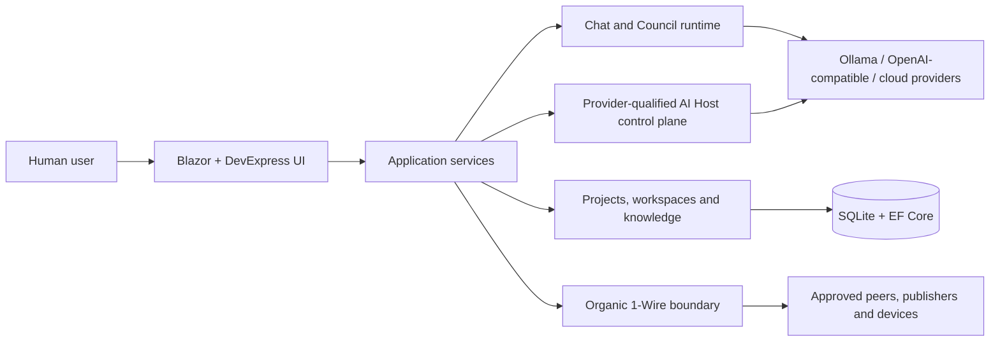

# LocalGPT documentation

**Version 2.9.8**

LocalGPT is a local-first AI workbench for direct chat, configurable AI Councils, project maintenance, persistent knowledge, provider-qualified model routing, embedded planning, game runtimes, and guarded local execution.

This site is the maintained product and architecture documentation. It deliberately separates stable design from historical experiments, so you can understand *what LocalGPT is now* without walking through every learning step that shaped it. 🐾

## Choose a path

### 🌸 Use LocalGPT

Start with the application concepts, common workflows, and the boundaries around actions that can change files, run tools, or operate hardware.

[Open the user guide](guide/index.md)

### 🧠 Understand the architecture

Follow the modular-monolith boundaries from Blazor UI through services, provider adapters, persistence, the AI Host control plane, Council orchestration, and 1-Wire transports.

[Explore the architecture](architecture/index.md)

### 🛠️ Build and maintain it

Read the compilation truth, diagnostics policy, documentation pipeline, release checks, and the rules that keep generated work reviewable.

[Open engineering guidance](engineering/index.md)

### 📚 Look up details

Use the capability map, design evolution notes, documentation migration map, or the complete XML-generated API reference.

[Browse reference material](reference/index.md)

## Architecture at a glance

The human request remains the authority. Model output, uploaded content, repository text, remote peers, and generated artifacts are data—not permission.

## Complete documentation set

The conceptual pages are built together with compiler-generated XML documentation for public types and members. The same themed HTML site is shipped inside LocalGPT and published to GitHub Pages.

The packaged PDF is rendered from the same reviewed Kawaii HTML tree as the website. It contains every maintained guide, architecture, engineering, and reference chapter together with every generated API page; a tiny source-only or fallback PDF is rejected by the release and Pages gates.

<a class="btn btn-primary" href="LocalGPT-2.9.8.pdf" download>🐾 Download the Kawaii handbook</a>
